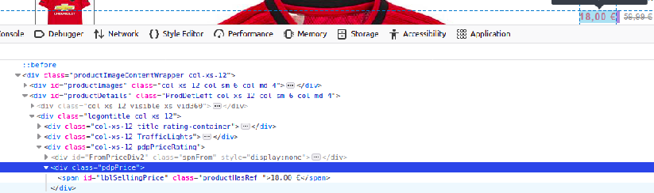

# discount notifier
a python script to produce desktop notifications when there is a discount in products i like from a [shoes shop](https://www.epapoutsia.gr), using [notify2](https://notify2.readthedocs.io/en/stable/#), [requests_html](https://github.com/psf/requests-html) and [beautifulSoup4](https://pypi.org/project/beautifulsoup4/)

## usage
1. install python3.6 or later
2. `pip3 install -r requirements.txt`
3. add the links of the item you want to be notified for in wishlist.txt (tap enter after each link)
4. `python3 notifier.py`
## how it works
this e-shop uses a div element with a special class name to display the new price after discount of a product,
so i used requests_html & bs4 libraries to get the HTML text and check if there is a div that contains a special price.
## use on other e-shops
* go to your preferred e-eshop, find a product that already has a discount and right click on the new price.
* select inspect or inspect element(Firefox)
* find the html element type and class or id name and copy them.
* change line 18 of notifier.py to match the element type and name.

For example:

now line 18 should be:
**special_price = html.findAll("div", {"class": "pdpPrice"})**
